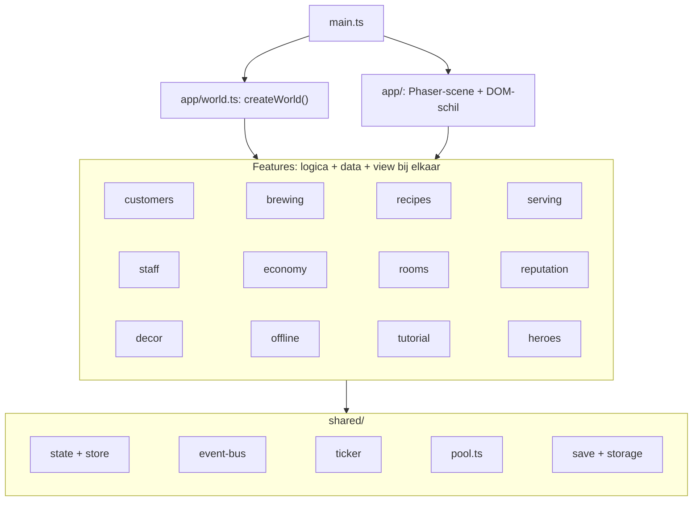
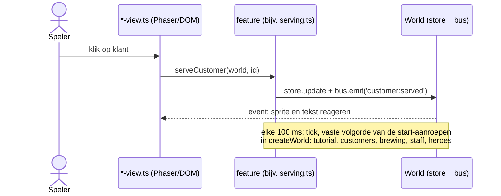

# Game Analyse: Brewmaster's Tavern (werktitel)

> Status: concept/analyse, nog geen code. Dit document is de basis voor alle beslissingen. Open vragen staan in hoofdstuk 12.
> Alle CrazyGames-specifieke eisen (bestandsgrootte, SDK, ads) moeten vóór de bouw nog gecheckt worden in de actuele CrazyGames-documentatie. Ze veranderen af en toe.

---

## 1. Naam

De naam mag veranderen. Opties:

| Naam | Sterk | Zwak |
|---|---|---|
| **Brewmaster's Tavern** | Duidelijk, zoekbaar, "brew" zegt meteen wat je doet | Wat generiek |
| **Potion Pub** | Kort, grappig, past bij schattige stijl | Minder "epic" |
| **Elixir Inn** | Mooi klinkend | "Inn" suggereert slapen, niet drinken |
| **Tavern Tycoon: Mystic Mixology** (origineel) | Genre direct duidelijk | Lang, moeilijk te onthouden als thumbnail-titel |
| **Brew & Blades** | Combineert brouwen + helden | Klinkt als gevechtsgame |

Voorlopige keuze: **Brewmaster's Tavern**. Vóór lancering checken of de naam al bestaat op CrazyGames of in app stores.

---

## 2. Pitch en doelgroep

**Eén zin:** Je runt een magische taverne: brouw drankjes, bedien fantasy-klanten, stuur helden de kerker in voor zeldzame ingrediënten, en bouw je krot uit tot een kasteel.

**Genre:** Idle/clicker + tycoon/management, met een lichte RPG-laag (helden).

**Doelgroep op CrazyGames:**
- Casual spelers, 12 tot 35 jaar, desktop eerst, mobiel als tweede.
- Spelers die van idle/incremental games houden (Cookie Clicker, AdVenture Capitalist, Egg Inc., Idle Miner).
- Spelers die zoeken naar "cozy" en "tycoon".

**Wat de game uniek moet maken (USP):** niet gewoon "getal gaat omhoog", maar een **combineer-en-ontdek-laag** (recepten) en een **zichtbare wereld** (de bar wordt vol met wezens). Dit zijn de twee dingen die de originele pitch al goed benoemt.

---

## 3. Ontwerppijlers

1. **5 seconden tot plezier.** Geen tutorial-muur. Eerste klik = eerste drankje = eerste goud.
2. **Diepte komt later.** Nieuwe systemen worden pas ontgrendeld na een paar minuten, zodat de speler nooit overweldigd wordt. Dat geldt ook voor drukte: klanten komen **geleidelijk**, niet meteen veel en niet snel achter elkaar. De speler begint met één plek in de bar (maximaal één klant tegelijk) en koopt extra plekken.
3. **Altijd iets te kopen.** Op elk moment is er een upgrade die bijna betaalbaar is.
4. **Visuele beloning.** Elke progressie is zichtbaar in de scene: nieuwe meubels, nieuwe klanten, drukte.
5. **Respect voor de speler.** Geen agressieve ads of pay-to-win. Ads alleen op natuurlijke momenten (zie hoofdstuk 9).

---

## 4. Core loop

```
Klant komt binnen
   -> bestelt drankje (zichtbaar in spraakwolk)
   -> speler brouwt (klik/hold) of personeel doet het automatisch
   -> serveren
   -> goud + reputatie
   -> upgrades kopen (ketels, personeel, kamers)
   -> sneller/meer/betere drankjes
   -> (terug naar begin, grotere schaal)
```

**Zij-loop (helden):**
```
Held inhuren -> uitrusten -> met drankjes op pad sturen
   -> timer loopt (ook offline)
   -> terug met ingrediënten + XP
   -> ingrediënten ontgrendelen nieuwe recepten
   -> betere drankjes = meer goud
```

**Meta-loop (prestige):** zie hoofdstuk 7.

### Handmatig versus idle
- **Actief spelen** geeft altijd meer opbrengst dan niets doen (combo's, snel serveren, bonus bij perfecte timing).
- **Idle** levert ongeveer 30 tot 40% van de actieve snelheid zodra personeel is ingehuurd. Zo blijft een tweede tabblad loont, maar loont actief spelen méér.
- **Offline-voortgang:** gelimiteerd (bijv. max 2 uur basis, uitbreidbaar via upgrades en rewarded ad voor dubbel).

---

## 5. Systemen in detail

### 5.1 Drankjes en recepten
- **100+ recepten** op termijn, gelanceerd met een kleinere set (zie fasering, hoofdstuk 10).
- Een recept = 2 of 3 ingrediënten + een brouwtijd + een verkoopprijs + een **effect** op de klant. Elk effect heeft een icoon (in de bestelbubbel, het boek en de zwevende tekst), zodat de speler ziet wat een drankje doet.
- **Ingrediënten:** de basisingrediënten staan vanaf het begin op het schap; nieuwe ingrediënten worden per reputatieniveau koopbaar in de winkel (eenmalig). Zeldzame ingrediënten komen later uit kerkers.
- **Effecten** (boosts): Kracht (klant betaalt meer), Snelheid (klant is sneller klaar met drinken, dus wisselt sneller), Geluk (kans op bonus/fooi), Charme (meer reputatie). Held-drankjes geven buffs op avontuur.
- **Ontdekmechaniek:** speler combineert ingrediënten in de ketel. Een onbekende combinatie kan een nieuw recept opleveren (stukjes "Eureka"-moment). Hints in het receptenboek (silhouetten van onontdekte drankjes) houden mensen zoekend.
- **Receptenboek (collectie):** grid met alle drankjes, voortgang X/100. Dit is een sterke retentiehaak voor completionisten. Het boek is ook het **naslagwerk**: bij elk ontdekt drankje staat hoe je het maakt (ingrediënten, brouwtijd, prijs, effect), zodat de speler niets hoeft te onthouden. Onontdekte drankjes zijn een silhouet met een hint.
- **Zeldzaamheid:** Common, Uncommon, Rare, Epic, Legendary, met kleurcodering.

Voorbeeld-ladder:
| Tier | Voorbeeld | Ingrediënten |
|---|---|---|
| 1 | Slijm-sap, Simpele mede | Slijm, Honing |
| 3 | Vuurborrel | Vuurbloem, Mede |
| 6 | Maanwijn | Maanlicht, Druif |
| 10 | Draken-Elixir | Drakenbloed, Sterrenstof |

### 5.2 Klanten
- Types: Ridder, Elf, Tovenaar, Dwerg, Ork, Schurk, Draak-in-mensvorm (zeldzaam), enz.
- Elk type heeft een **voorkeur** voor één of meer effecten (bijv. dwergen houden van kracht, elfen van charme). Een drankje met dat effect = het effect telt dubbel, met een ♥ bij de bestelling; klanten bestellen hun voorkeur ook vaker. Dit geeft keuzes zonder complexiteit.
- **Geduld-balk:** te lang wachten = klant gaat weg (geen straf voor idle-modus, wel voor actief spel, anders irritant).
- **VIP-klanten** (koningen, beroemde helden) verschijnen willekeurig, betalen veel, vragen een specifiek duur drankje.
- Klantaantal en variatie schalen mee met reputatie.
- **Geleidelijke instroom:** in het begin komen klanten rustig, één voor één. De speler begint met **één plek** (maximaal één klant tegelijk in de bar) en koopt **extra plekken** als upgrade; later komen er plekken bij via kamers. Zo groeit de drukte mee met wat de speler aankan.

### 5.3 Reputatie
- Verdiend door tevreden klanten. Reputatie-niveaus ontgrendelen: nieuwe klanttypes, kamers, recepten, helden-slots.
- Dient als **zachte gate**: je kunt niet alleen goud grinden, je moet ook goede service leveren.

### 5.4 Upgrades en uitbreidingen
- **Ketels:** snelheid, capaciteit, automatisering, speciale ketels (vuur, ijs, arcane) voor hogere tiers.
- **Personeel:** barman, serveerster, brouwer-assistent. Elk met niveaus en eigenschappen. Eventueel namen en kleine persoonlijkheden (charme).
- **Kamers** (ontgrendelen via goud + reputatie):
  1. Houten krot (start)
  2. Uitbouw met meer tafels
  3. Alchemielab (extra recept-slots, ingrediënt-verwerking)
  4. VIP-lounge
  5. Podium met minstrelen (passieve bonus op fooien)
  6. Casino-hoek (minigame, risico/beloning)
  7. Kasteel-verdiepingen
- **Plekken in de bar** (upgrade, misschien later): betalen voor extra klantplekken, beginnend bij één.
- Cosmetische **decoratie** als goud-sink: fakkels, tapijten, trofeeën (kleine bonussen + puur plezier).

### 5.5 Helden-gilde
- Helden worden **ingehuurd**, hebben klasse (Krijger, Boogschutter, Magiër, Schurk), level, uitrusting.
- **Uitrusting:** zwaard, schild, helm, amulet. Gekocht of gevonden.
- **Expedities:** kies kerker + held(en) + drankjes meenemen. Duur: 30 sec tot uren. Resultaat: ingrediënten, XP, soms uitrusting.
- **Kerkers:** meerdere zones (Moeras, Grot, Vulkaan, Sterrentoren, Drakenhol). Diepere zone = betere ingrediënten, hogere vereiste level.
- **Risico:** held kan "gewond" raken (cooldown), maar niet sterven. Geen echte straf, geen frustratie.
- Het meenemen van **eigen drankjes** is de koppeling met de brouw-loop, en dus het hart van het concept: drankkwaliteit bepaalt het succes.
- **Eerste versie (uitgewerkt 2026-10-07):** krijger en magiër, het Moeras als eerste kerker, een tweede ketel in de gildekamer voor heldendrankjes, en kerker-ingrediënten als voorraad die opraakt. Details: SPECS.md, hoofdstuk 4, Helden.

### 5.6 Minigames en events (later)
- Casino-hoek: simpele dobbelspellen of kaarten.
- Tijdelijke events (seizoenen, zoals Halloween-taverne) voor terugkerende spelers.
- Dagelijkse bonus en dagelijkse taken.

---

## 6. Economie en balans

Dit is het belangrijkste onderdeel van een idle-game en moet in een spreadsheet worden doorgerekend vóór we het inbouwen.

- **Exponentiële kosten, lineaire/superlineaire opbrengst.** Standaardformule voor upgradekosten: `kosten(n) = basis * groeifactor^n` met groeifactor tussen 1.07 en 1.15.
- **Grote getallen:** de game komt in K/M/B/T/aa/ab-notatie. Een bibliotheek voor grote getallen (bijv. `break_infinity.js`) is nodig, want gewone JS-getallen breken af bij ~1e308 en verliezen precisie.
- **Tempo van progressie (doel):**
  - Eerste 5 minuten: ~10 aankopen, eerste personeelslid, eerste nieuw recept.
  - Eerste 30 minuten: eerste kamer, eerste held, ~15 recepten.
  - 1 tot 2 uur: eerste prestige beschikbaar.
  - Prestige-cycli moeten korter worden (bijv. 2 uur, dan 1 uur, dan 30 min) maar met grotere getallen.
- **Soft caps en muren:** elke tier heeft een "muur" die ingrediënten van helden nodig heeft, zodat de beide loops met elkaar verweven blijven.
- **Valuta's:**
  - Goud (hoofdvaluta)
  - Reputatie (gate)
  - Ingrediënten (per type, via helden)
  - **Gouden Hop** (prestige-valuta, permanent)
  - Eventueel **Edelstenen** (zeldzaam, via dagelijkse beloning/ads, voor cosmetica en tijdbesparing; geen echt geld)
- Een **balans-spreadsheet** (Google Sheets) wordt een eigen deliverable, zodat we getallen kunnen aanpassen zonder code.

---

## 7. Prestige-systeem

- Na ~max level van de huidige bar: **"Verkoop de taverne"** en krijg **Gouden Hop**, gebaseerd op totale verdiende goud (bijv. `hop = floor(sqrt(totaalGoud / drempel))`).
- Gouden Hop = permanente multiplier (bijv. +2% per Hop) én koopbaar in een **permanente skill-tree** ("Brouwerij-erfenis"): offline-limiet, startgoud, snellere helden, enz.
- **Wat reset:** goud, ketels, personeel, kamers, held-levels.
- **Wat blijft:** recepten (de ontdekking blijft), receptenboek, cosmetica, Gouden Hop-tree, achievements.
- Dat laatste is bewust: recepten behouden voorkomt dat prestige "alles weggooien" voelt.
- Tweede prestige-laag later mogelijk (bijv. "Legendarische Taverne"), maar pas na lancering en data.

---

## 8. Visuele stijl, audio en UX

### Stijl
Keuzes (zie vragen):
- **Cartoon 2D, kleurrijk, "cozy"** is de veiligste en best schaalbare keuze.
- Zijaanzicht-doorsnede van de taverne (zoals een poppenhuis): je ziet alle kamers naast/boven elkaar. Past perfect bij "visuele progressie", en de camera hoeft niet te bewegen.
- Klanten als simpele sprites met 2 tot 4 frame animaties (lopen, drinken, blij).
- Asset-aanpak: zie hoofdstuk 11 (kopen/genereren/zelf tekenen).

### UI
- Minimalistisch, grote knoppen, goed op muis én touch.
- Duidelijke feedback: opspringende "+12 goud", partikels bij ontdekking, scherm-shake bij legendarisch drankje.
- Alles klikbaar op desktop zonder toetsenbord nodig.
- Bruikbaar op 16:9 en op mobiel (responsive canvas).

### Audio
- Sfeervolle loopbare muziek (taverne/folk), aparte volumeregelaars voor muziek en effecten, en een **mute-knop** zichtbaar.
- Kleine, bevredigende geluidjes: munt, brouwgeborrel, klantlach, level-up.
- Audio mag niet starten vóór de eerste gebruikersinteractie (browser-eis).

---

## 9. CrazyGames-specifieke eisen en kansen

*(Te verifiëren in de officiële CrazyGames-docs vóór de bouw.)*

- **Platform:** HTML5, draait in een iframe. Moet snel laden. CrazyGames hanteert richtlijnen voor de initiële downloadgrootte (orde van enkele tientallen MB; houd het zo klein mogelijk) en een totaalgrootte-limiet.
- **CrazyGames SDK integreren:**
  - **Ads:** midgame-ads op natuurlijke pauzes (bijv. na een prestige of terugkeer van een expeditie) en **rewarded ads** (opt-in: dubbele offline-beloning, tijdelijke boost, extra held-slot-tijd). Nooit een ad zonder dat de speler iets doet of een natuurlijk moment.
  - **Gameplay start/stop-signalen:** de SDK wil weten wanneer de speler echt speelt (belangrijk voor ads en statistiek).
  - **Data-module / cloud-save:** opslag gekoppeld aan het CrazyGames-account, met `localStorage` als terugval.
  - **Taalondersteuning** en eventuele gebruikersinfo via de SDK.
- **Regels waar we op moeten letten:** geen externe links, geen eigen advertenties of social-links in de game, geen eigen "betaal met geld"-systeem, geen inhoud die niet voor alle leeftijden past, geen auto-play geluid vóór interactie, en de game moet netjes pauzeren als de SDK dat vraagt (ads).
- **Mobiel:** CrazyGames heeft veel mobiel verkeer. Een mobielvriendelijke versie vergroot bereik aanzienlijk en is dus aan te raden.
- **Lanceertraject:** CrazyGames heeft een instroom- en beoordelingsproces (eerst beperkte lancering/test, later volledige lancering afhankelijk van prestatie, zoals speeltijd en retentie). Dit betekent dat **speeltijd en retentie** de belangrijkste meetpunten zijn, en dus de focus van het ontwerp.
- **Thumbnail en titel:** zijn bepalend voor klikratio. Aparte taak voor een aantrekkelijke thumbnail (meerdere formaten).

---

## 10. Fasering en roadmap

**Fase 0: Voorbereiding**
- Keuzes beantwoorden (hoofdstuk 12), CrazyGames-documentatie doornemen, developer-account aanmaken.
- Balans-spreadsheet opzetten.
- Stijl-moodboard.

**Fase 1: Prototype (grijze doos)**
- Eén ketel, één klanttype, drie recepten, goud, een paar upgrades.
- Doel: is klikken en serveren leuk? Is de eerste 5 minuten verslavend? Zo niet, niets anders heeft zin.

**Fase 2: Vertical slice**
- Echte (voorlopige) art, geluid, personeel, reputatie, eerste kamer-uitbreiding.
- Opslaan/laden en offline-voortgang.
- ~20 recepten, 5 klanttypes.

**Fase 3: Heldenlaag**
- Helden, expedities, kerkers, ingrediënten, uitrusting.
- Receptenboek en ontdekmechaniek.

**Fase 4: Prestige en content**
- Prestige-systeem en skill-tree.
- Doorgroeien naar 60 en later 100+ recepten, alle kamers, achievements.

**Fase 5: Polish en SDK**
- CrazyGames SDK (ads, cloud-save), mobiele UX, performance, laadtijd, taal.
- Tutorial-ontwerp (subtiel, via contextuele hints).

**Fase 6: Testen en lanceren**
- Playtests (vrienden + anderen), speeltijdmeting, balans bijstellen.
- Indienen bij CrazyGames, thumbnail, beschrijving.

**Fase 7: Live-ops (na lancering)**
- Events, nieuwe recepten/kerkers, balans op basis van data, vertalingen.

### MVP-definitie (minimum om in te dienen)
Core loop + ~30 recepten + personeel + 3 kamers + helden (basisversie) + prestige (eerste laag) + cloud-save + ads-integratie. De rest is content na lancering.

---

## 11. Technische aanpak

### Aanbevolen stack
| Onderdeel | Keuze | Reden |
|---|---|---|
| Taal | **TypeScript** | Veiligheid in een groeiende codebase |
| Engine | **Phaser 3** (voorstel) of **PixiJS** | Phaser: complete 2D-game-framework (scenes, input, audio, tweens). Pixi: lichter, meer vrijheid, UI zelf bouwen. |
| Build | **Vite** | Snel, klein, makkelijke productiebundel |
| Grote getallen | `break_infinity.js` / `decimal.js` | Idle-getallen groeien exponentieel |
| UI | Phaser UI of DOM-overlay | DOM is makkelijker voor menu's en tekst, canvas voor de wereld |
| Opslag | CrazyGames SDK data-module + `localStorage` | Cloud-save + fallback |
| Audio | Howler.js of Phaser audio | Cross-browser betrouwbaar |
| Data | JSON-bestanden voor recepten, klanten, kerkers, upgrades | Content los van code, makkelijk te balanceren |
| Tests | Vitest voor economie/logica | Economie-bugs voorkomen |

*Alternatief:* Unity WebGL of Godot web-export. **Niet aanbevolen** voor deze game: grotere downloads, langere laadtijd, en dat is net wat CrazyGames-spelers afhaakt.

### Architectuurprincipes
- **Game-logica losgekoppeld van rendering.** Een "simulatiekern" (puur TypeScript, geen Phaser) die de economie draait. Rendering leest alleen de state. Voordelen: testbaar, offline-berekening makkelijk, en we kunnen de economie los balanceren.
- **Data-gedreven content.** Recepten, helden, kerkers, upgrades staan in JSON/TS-tabellen. Nieuwe content toevoegen = data toevoegen, geen code.
- **Vaste tick-rate** voor de simulatie (bijv. 10x per seconde) los van framerate.
- **Offline-voortgang** berekend bij laden op basis van tijdsverschil (niet door alle ticks te simuleren, maar met een formule).
- **Browser-throttling:** tabbladen op de achtergrond vertragen timers sterk. Daarom werken we met `Date.now()`-delta in plaats van tel-ticks, zodat de idle-voortgang klopt.
- **Save-versies en migratie:** elke save krijgt een versienummer zodat we later nieuwe velden kunnen toevoegen zonder spelers hun voortgang te laten verliezen.
- **Event-systeem** (achievements, tutorial-hints, statistieken) via een simpele event-bus.
- **Performance:** objectpooling voor klanten en partikels (zero-allocation in de game-loop), spritesheets/atlassen, lazy loading van latere content, doel 60 FPS op een gemiddelde laptop en bruikbaar op middenklasse telefoons.

### Architectuur: plat, per feature (besluit 2026-10-07)

De eerste opzet had veel kleine lagen (`core/`, `systems/`, `wiring/`, `sim/`, `data/`) met bestanden van gemiddeld 29 regels: voor één persoon onleesbaar ("ravioli-code"). De architectuur is daarom vlak gemaakt: **een feature is een map** met logica, data en view bij elkaar. Een map is maximaal één niveau diep.

```
src/
  main.ts  config.ts
  shared/      state, events, time (ticker), numbers, random, pool, targets, save, storage, debug
  app/         world.ts (bouwt alles, bepaalt de tick-volgorde), Phaser-scene en DOM-schil
  customers/  brewing/  recipes/  serving/  staff/  economy/
  rooms/  decor/  reputation/  offline/  tutorial/  heroes/    (toekomst: prestige/, achievements/, audio/, platform/)
  i18n/        translator.ts, en.ts (met en-shop.ts en en-heroes.ts per gebied)
  dev/         balans-simulator
```

Per feature: `<feature>.ts` (spelregels en acties, puur) en `*-view.ts` (Phaser of DOM). Groot of kring-brekend? Dan komt er een `*-data.ts` (recepten, upgrades, klanttypes, tutorialstappen) of `*-model.ts` (pure view-models) bij. Alleen `*-view.ts`, `*-scene.ts` en `main.ts` kennen Phaser en DOM; al het andere draait ook in Node (Vitest, simulator, offline-berekening).





- **World:** één object `{ store, bus, rng, clock, content, floor, station, selection, targets, tutorial, offline }`. Spelersacties zijn gewone functies per feature die `world` (of een `Pick<World, ...>`) krijgen; rekenfuncties (prijs, kosten, niveau) blijven puur. Tijd, willekeur en opslag worden ingespoten, dus tests en de simulator zijn deterministisch.
- **Afhankelijkheden:** `app` → features → `shared`. Features mogen elkaar importeren, maar niet in een kring tussen bestanden (`npm run cycles` bewaakt dat).
- **Bestandsgrootte:** 150 tot 300 regels per bestand als de functies bij elkaar horen.
- Het volledige regelwerk (en wat bewust is weggelaten: barrels, wiring, aparte store-interfaces) staat in `CLAUDE.md` en `docs/SPECS.md` hoofdstuk 4 en 9.

### SDK-wrapper
Alles wat CrazyGames raakt zit in **één module** met een mock voor lokaal ontwikkelen. Zo kunnen we de game ook los van CrazyGames draaien en testen.

---

## 12. Open vragen (nodig om verder te kunnen)

Zie ook de vragen in de chat. Beantwoord ze en dan werk ik dit document bij.

1. **Ervaring:** programmeerervaring (JavaScript/TypeScript?) en eerdere games? Bepaalt of we met Phaser of iets eenvoudigers starten.
2. **Art:** zelf tekenen, assets kopen, AI-gegenereerd, of placeholder-first? (Cruciaal voor budget en stijl.)
3. **Doelplatform:** alleen desktop, of vanaf het begin ook mobiel?
4. **Tijdsbudget en deadline:** hoeveel uur per week, en is er een streefdatum?
5. **Budget:** wat mag er uitgegeven worden aan assets, muziek, tools?
6. **Taal:** alleen Engels, of ook Nederlands en andere talen?
7. **Monetisatie:** alleen ads via CrazyGames, of is er verder iets gewenst?
8. **Toon:** grappig/absurd, cozy/rustig, of episch/donker?
9. **Naam:** akkoord met "Brewmaster's Tavern" of een voorkeur?
10. **Scope:** klopt de MVP-definitie, of eerst kleiner (zonder helden) of juist groter?

---

## 13. Risico's

| Risico | Impact | Mitigatie |
|---|---|---|
| Scope te groot (100+ recepten, helden, kamers, prestige) | Game wordt nooit af | Strikte MVP, data-gedreven content, fasering |
| Economie niet in balans (te snel/traag) | Spelers haken af | Spreadsheet-eerst, playtesten, tuning-knoppen in debug-modus |
| Weinig kunstmiddelen/kwaliteit | Thumbnail en eerste indruk zwak | Stijlkeuze die met weinig assets werkt (besloten: pixel art, zie SPEC stap 21), eerste investeren in thumbnail en klant-sprites |
| Laadtijd/bestandsgrootte | Spelers vertrekken, CrazyGames-afwijzing | Gecomprimeerde assets, atlassen, lazy loading |
| Lage retentie | CrazyGames promoot niet | Sterke eerste 5 minuten, dagelijkse beloningen, duidelijke volgende doelen |
| Idle-bugs (offline-berekening, grote getallen) | Voortgang kapot | Testen van simulatiekern, save-versies, back-ups |
| Gelijkenis met bestaande games | Weinig onderscheid | Focus op ontdek-/receptenlaag en visuele taverne-groei |

---

## 14. Succescriteria

- Gemiddelde sessieduur van 10+ minuten.
- Spelers komen terug (dag-1-retentie als hoofdmeting).
- Eerste 60 seconden: speler heeft minstens 3 aankopen gedaan.
- Geen kritieke bugs in opslaan/laden.
- Laadtijd onder enkele seconden.

---

## 15. Volgende stappen

1. Vragen uit hoofdstuk 12 beantwoorden.
2. Document bijwerken en keuzes vastleggen.
3. CrazyGames-docs doornemen en eisen definitief maken.
4. Balans-spreadsheet en prototype-plan (Fase 1) opstellen.
5. Pas daarna: projectopzet en code.
